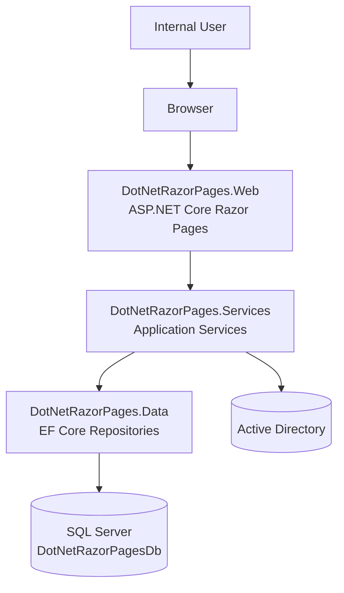
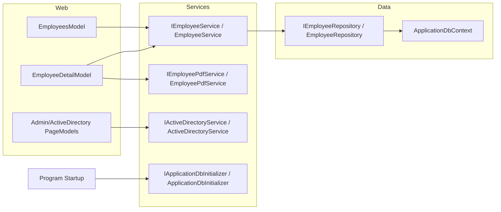
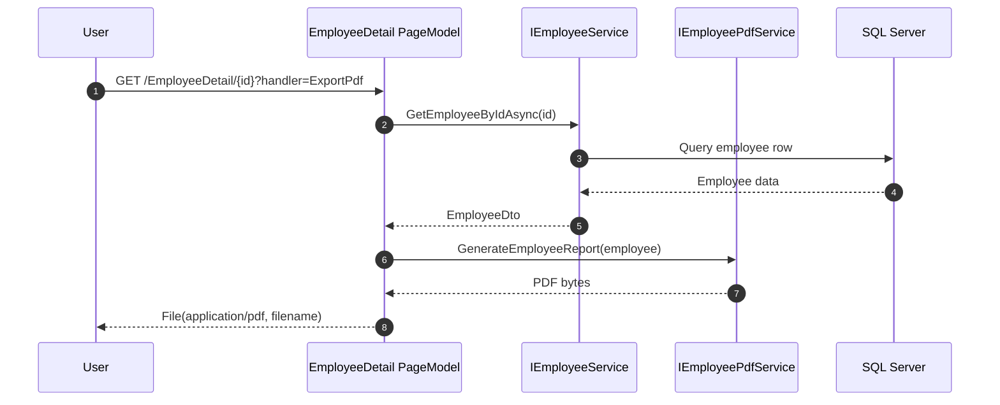

# DotNet Razor Pages Architecture

## Document Control
- Document ID: DRP-ARCH-001
- Version: 1.0
- Date: 2026-03-18
- Status: Draft (working baseline)

## 1. Architecture Summary
The solution follows a layered architecture:
- Presentation: `DotNetRazorPages.Web`
- Application/Domain Services: `DotNetRazorPages.Services`
- Data Access: `DotNetRazorPages.Data`
- Quality Gate: `DotNetRazorPages.Tests`

Primary flow:
1. Razor Page handlers receive HTTP requests.
2. Page models call service abstractions.
3. Services coordinate business logic and call repositories.
4. Repositories execute EF Core operations against SQL Server.

## 2. Technology Stack
- Runtime: .NET 10
- Web framework: ASP.NET Core Razor Pages
- ORM: Entity Framework Core (SQL Server provider)
- Authentication: Cookie authentication
- Authorization: Policy-based role evaluation
- PDF generation: QuestPDF
- Test frameworks: xUnit, ASP.NET Core test host, EF in-memory/SQLite test providers

## 3. Layer Responsibilities

### 3.1 Web Layer (`DotNetRazorPages.Web`)
- Hosts Razor Pages and static assets
- Configures middleware pipeline
- Handles authentication and authorization policy registration
- Binds request/query/form data in page models

### 3.2 Services Layer (`DotNetRazorPages.Services`)
- Contains business services and abstractions
- Maps between Data entities and service DTOs
- Provides startup initialization/seeding implementation
- Provides PDF generation service for employee detail exports
- Provides Active Directory integration service abstraction

### 3.3 Data Layer (`DotNetRazorPages.Data`)
- Defines `ApplicationDbContext`
- Defines entities and repository abstractions/implementations
- Encapsulates query behavior: paging, sorting, filtering
- Configures SQL Server EF Core integration

### 3.4 Test Layer (`DotNetRazorPages.Tests`)
- Unit tests for page models/services behavior
- Integration tests for data and repository behavior
- Functional tests for endpoint authorization and web behavior

## 4. Container Diagram (C4 - Level 2)

## 5. Component Diagram (Application)

## 6. Sequence Diagram: Employee PDF Export

## 7. Security Architecture Notes
- Cookie authentication configured in startup.
- Admin authorization policy checks role claims against configured role list.
- Unauthenticated users are redirected to login; unauthorized users to access denied.
- HSTS and exception handling are enabled for non-development environments.

## 8. Data Model Overview
Primary entity: Employee
- Id (PK)
- FirstName (required, max 100)
- LastName (required, max 100)
- Email (required, max 256)
- JobTitle (required, max 150)
- HireDate (required)
- IsActive (required)

Key constraints:
- Unique index on `(FirstName, LastName)`

## 9. Deployment View (Current)
- App host: ASP.NET Core process (single web app)
- Database: SQL Server instance (local container for development)
- Static assets served by web app

## 10. Operational Considerations
- On startup, application initializes DB and ensures seed minimum dataset.
- Configuration is environment-driven through `appsettings*.json` and standard .NET configuration providers.
- Current local defaults include development credentials; production overrides are required.

## 11. Risks and Technical Debt
- Authentication strategy is development-oriented; enterprise SSO integration pending.
- Direct AD bind credentials in settings should move to secure secret storage in production.
- Explicit observability SLOs and structured telemetry standards should be formalized.
