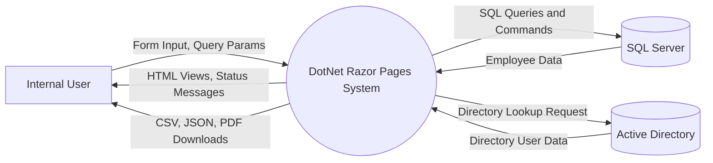
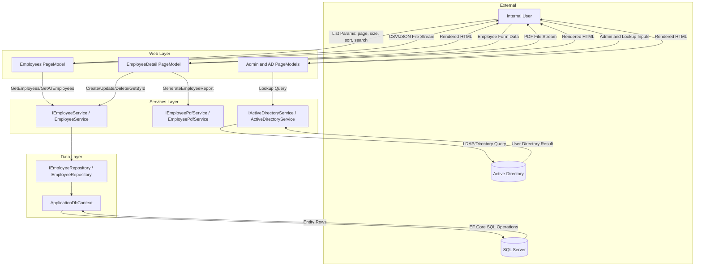
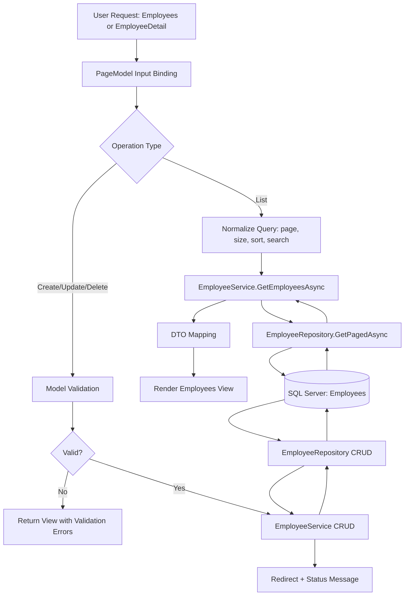
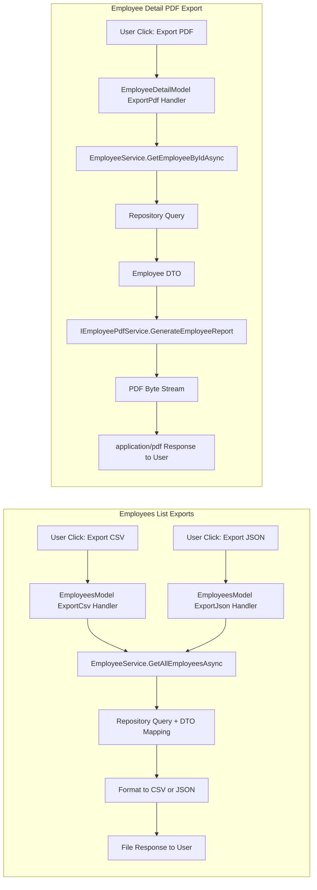

# DotNet Razor Pages Data Flow Chart

## Document Control
- Document ID: DRP-DFD-001
- Version: 1.0
- Date: 2026-03-18
- Status: Draft
- Audience: Engineering, QA, Security, Architecture

## 1. Purpose
This document defines how data moves through the DotNet Razor Pages solution, from user input through business processing, persistence, and export output.

## 2. Data Flow Diagram (Level 0 - Context)

## 3. Data Flow Diagram (Level 1 - Application Internals)

## 4. Data Flow Diagram (Level 2 - Employee CRUD and List)

## 5. Data Flow Diagram (Level 2 - Export Flows)

## 6. Data Stores and Data Objects

### 6.1 Data Stores
- SQL Server database: employee master records
- Active Directory: directory identity attributes for admin lookup workflows

### 6.2 Primary Data Objects
- Employee Input Model (web binding)
- Employee DTO (service boundary)
- Employee Entity (data persistence)
- Export payloads (CSV text, JSON text, PDF bytes)

## 7. Data Governance Notes
- Input validation occurs at model-binding and service boundaries.
- Read operations use paged and filtered queries for performance.
- Export endpoints generate downloadable artifacts derived from current query/entity state.
- Role-based authorization controls route access for admin and directory features.

## 8. Related Documents
- User flows: docs/USER_FLOWS.md
- Requirements: docs/REQUIREMENTS.md
- Architecture: docs/ARCHITECTURE.md
- Systems architecture: docs/SYSTEMS_ARCHITECTURE.md
