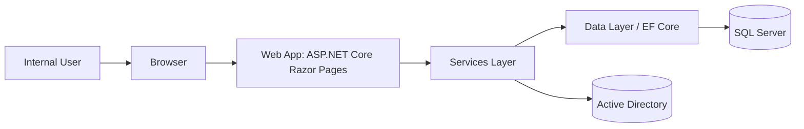
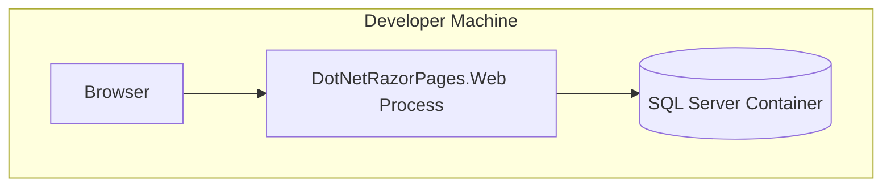
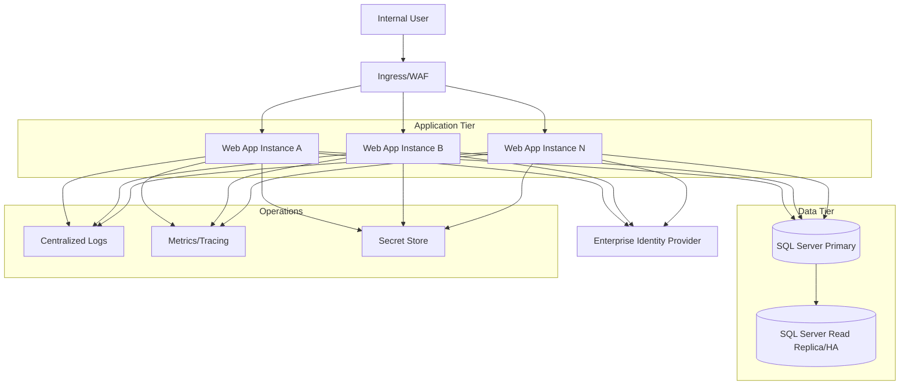
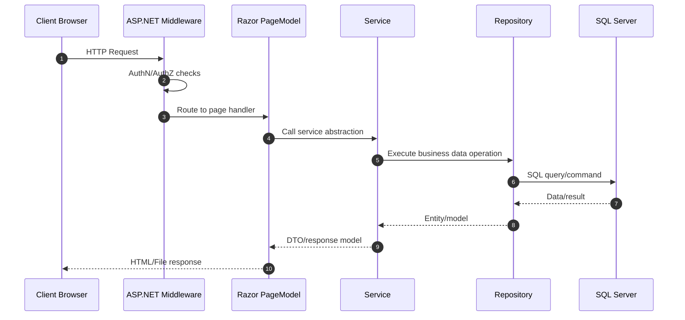
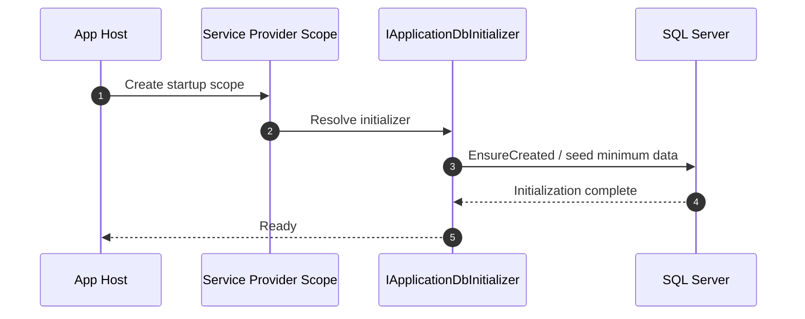

# DotNet Razor Pages Systems Architecture

## Document Control
- Document ID: DRP-SYS-ARCH-001
- Version: 1.0
- Date: 2026-03-18
- Status: Draft (baseline)
- Owners: Engineering, Security, Operations

## 1. Purpose
This document describes the end-to-end systems architecture of the DotNet Razor Pages solution, including runtime topology, trust boundaries, integration points, operational concerns, and target-state recommendations for enterprise deployment.

## 2. System Scope
The system is an internal employee management platform that provides:
- Employee CRUD and searchable listings
- Data exports (CSV, JSON, PDF)
- Role-restricted admin capabilities
- Optional Active Directory lookups

## 3. Architecture Drivers
- Keep implementation simple and maintainable for a small internal product
- Enforce clear layer boundaries (Web -> Services -> Data)
- Provide secure role-based access to privileged features
- Support local and enterprise deployment patterns
- Enable repeatable operations with automated tests and startup initialization

## 4. Current Runtime Topology (Logical)


## 5. Deployment Topology (Current and Target)

### 5.1 Current (Developer Local)


### 5.2 Target (Enterprise Environment)


## 6. Trust Boundaries and Security Zones
```mermaid
flowchart LR
    subgraph Zone1[User Zone]
      U[Internal User Browser]
    end

    subgraph Zone2[Application Zone]
      APP[ASP.NET Core Web App]
    end

    subgraph Zone3[Data and Directory Zone]
      SQL[(SQL Server)]
      AD[(Active Directory)]
    end

    U -->|HTTPS| APP
    APP -->|DB Connection (TLS recommended)| SQL
    APP -->|LDAP/LDAPS| AD
```

Security controls (baseline):
- Authentication via cookie middleware (development-friendly model in current state)
- Authorization via role-based policy (`AdminOnly`) and claims evaluation
- HSTS enabled for non-development runtime
- Startup fail-fast behavior on missing required DB connection string

Required enterprise hardening:
- Replace development auth model with enterprise SSO (OIDC/Entra ID)
- Move credentials and bind secrets to managed secret store
- Enforce TLS for all service-to-service traffic
- Add structured audit logging for privileged actions and exports

## 7. Core Runtime Flows

### 7.1 Request/Response Flow


### 7.2 Startup Initialization Flow


## 8. Data Architecture
Primary store: SQL Server
- Database: `DotNetRazorPagesDb`
- Core table: `Employees`
- Key index: unique index on `(FirstName, LastName)`

Data access characteristics:
- EF Core with SQL Server provider
- Repository pattern for encapsulated querying
- Server-side paging/sorting/filtering paths
- AsNoTracking used for read-heavy operations

## 9. Integration Architecture
External dependency: Active Directory
- Encapsulated behind `IActiveDirectoryService`
- Configuration-driven (domain, container, bind account, SSL flag)
- Should use LDAPS and managed credentials in enterprise mode

## 10. Availability, Scalability, and Resilience
Current state:
- Single app process in local dev
- SQL container-backed persistence

Target enterprise posture:
- Horizontal app scaling behind ingress/load balancer
- SQL HA/replication strategy
- Health checks and graceful shutdown
- Connection retry policies and transient fault handling
- Backup/restore validation and DR runbooks

## 11. Observability and Operations
Recommended baseline:
- Structured logs with correlation IDs
- Request, dependency, and exception telemetry
- Metrics for latency, throughput, and error rates
- Alerting on auth failures, export errors, and DB connectivity issues
- Deployment dashboards and release annotations

## 12. Deployment and Configuration Model
Configuration sources:
- `appsettings.json` + environment overrides + environment variables

Deployment recommendations:
- Immutable artifact builds
- Environment-specific configuration overlays
- Secret injection at runtime (never in source-controlled config)
- Blue/green or rolling deployment strategy

## 13. Risks and Mitigations
- Risk: Development auth model used in production
  - Mitigation: Enforce enterprise IdP integration before production release
- Risk: Credential leakage via static config
  - Mitigation: Move to managed secret store and key rotation policy
- Risk: Limited operational visibility
  - Mitigation: Implement centralized telemetry and SLO-driven alerting

## 14. Architecture Decisions (Current)
- AD-001: Layered monolith architecture for delivery speed and simplicity
- AD-002: EF Core repository abstraction to isolate data access concerns
- AD-003: Cookie + role policy authorization as current baseline
- AD-004: QuestPDF selected for server-side PDF generation

## 15. Related Documents
- Requirements specification: `docs/requirements.md`
- Solution architecture overview: `docs/architecture.md`
- One-page stakeholder summary: `docs/one-page-summary.md`
