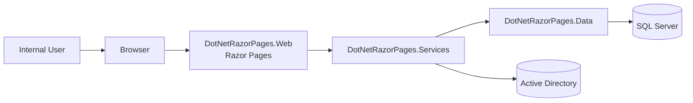

# ASP.NET Razor Pages Enterprise Template (Pre-Filled Example)

## How to Use This Template
- Use this as a baseline for new enterprise Razor Pages solutions.
- Replace values in angle brackets where needed, but keep section structure for governance consistency.
- This version is pre-filled with the DotNet Razor Pages solution values.

---

## 1. Solution Profile
- Solution Name: DotNetRazorPages
- Repository: jessnavjr/dotnet-razor-pages
- Runtime: .NET 10
- Web Stack: ASP.NET Core Razor Pages
- Primary Data Store: SQL Server
- Architecture Style: Layered monolith (Web -> Services -> Data)
- Deployment Model (current): Single web app + SQL Server (local container for dev)

Template values:
- Solution Name: <YourSolutionName>
- Runtime: <dotnet-version>
- Primary Data Store: <database>
- Architecture Style: <style>

---

## 2. Business Context
### 2.1 Problem Statement
The platform provides internal employee management workflows with secure administrative controls and export capabilities.

### 2.2 Business Outcomes
- Improve operational efficiency for employee record maintenance
- Enable reporting through CSV, JSON, and PDF export artifacts
- Enforce role-based administrative access

Template values:
- Problem Statement: <business-problem>
- Outcomes: <outcome-1>, <outcome-2>, <outcome-3>

---

## 3. Scope Definition
### In Scope
- Employee CRUD
- Search, sorting, pagination
- CSV/JSON list export
- PDF detail export
- Admin/Active Directory role-restricted workflows

### Out of Scope
- Public APIs
- External self-service registration
- Final enterprise SSO implementation (target-state item)

Template values:
- In Scope: <bullet-list>
- Out of Scope: <bullet-list>

---

## 4. Architecture Blueprint
### 4.1 Logical Architecture

### 4.2 Layer Responsibilities
- Web Layer: request routing, page models, auth middleware, rendering, file responses
- Services Layer: business logic, DTO mapping, PDF generation, directory abstractions
- Data Layer: EF Core context, repositories, query composition, persistence
- Tests Layer: unit, integration, and functional validation

Template values:
- External Integrations: <list>
- Layer Constraints: <dependency-rules>

---

## 5. Security and Compliance Baseline
### Current Controls
- Cookie authentication
- Role-based authorization policy (`AdminOnly`)
- Redirect rules for unauthenticated/unauthorized users
- HSTS in non-development environments

### Required Enterprise Hardening
- Integrate enterprise identity provider (OIDC/Entra ID)
- Move secrets to managed secret store
- Enforce TLS for all downstream connections
- Add audit trail for privileged actions and exports

Template values:
- Identity Provider: <idp>
- Secret Store: <vault>
- Audit Requirements: <requirements>

---

## 6. Data and Integration Model
### Core Entity
Employee:
- Id, FirstName, LastName, Email, JobTitle, HireDate, IsActive
- Unique index: FirstName + LastName

### Integrations
- SQL Server via EF Core
- Active Directory lookup service abstraction
- QuestPDF for server-side PDF generation

Template values:
- Core Entities: <entities>
- Data Retention: <policy>
- Integration Contracts: <contracts>

---

## 7. API/Page Contract Summary
### Key Routes
- `/Employees` (list + filters + sort + pagination)
- `/EmployeeDetail/{id?}` (create/edit/delete)
- `/Employees?handler=ExportCsv`
- `/Employees?handler=ExportJson`
- `/EmployeeDetail/{id}?handler=ExportPdf&id={id}`
- `/Admin` (role restricted)
- `/Admin/ActiveDirectory` (role restricted)
- `/Login`, `/AccessDenied`

Template values:
- Protected Routes: <routes>
- Public Routes: <routes>

---

## 8. Non-Functional Requirements Snapshot
- Reliability: fail fast on missing required DB connection string
- Performance: server-side paging and query filtering
- Maintainability: strict layer boundaries and interface-based abstractions
- Testability: unit + integration + functional test coverage

Template values:
- Availability Target: <slo>
- Latency Target: <slo>
- Error Budget: <target>

---

## 9. DevSecOps and Operations Template
### Build and Validation
- Build: `dotnet build DotNetRazorPages.sln`
- Tests: `dotnet test DotNetRazorPages.Tests/DotNetRazorPages.Tests.csproj -c Debug`

### Operational Controls (Target)
- Centralized logging and tracing
- Health checks and alerting
- Backup and restore verification
- Release strategy: rolling or blue/green

Template values:
- CI Platform: <platform>
- Deployment Strategy: <strategy>
- Monitoring Stack: <stack>

---

## 10. Governance Artifacts Checklist
- Requirements specification
- Architecture overview and system architecture
- User flows and wireframes
- Data flow chart
- Test strategy and evidence
- Security review and threat model
- Release readiness checklist

Current solution status:
- Requirements: available
- Architecture docs: available
- User flows and wireframes: available
- Data flow chart: available

Template values:
- Required Artifacts: <org-standard-list>

---

## 11. Risks and Mitigation Plan
- Risk: development-oriented auth model in production
  - Mitigation: enterprise SSO before go-live
- Risk: credentials in configuration
  - Mitigation: managed secrets + rotation
- Risk: insufficient observability
  - Mitigation: standard telemetry and SLO alerts

Template values:
- Top Risks: <risk-list>
- Mitigation Owners: <owners>

---

## 12. Enterprise Readiness Scorecard (Template)
| Domain | Status | Notes |
|---|---|---|
| Architecture | Green | Layered architecture and docs in place |
| Security | Amber | Needs enterprise SSO and secrets hardening |
| Data | Green | SQL model and repository pattern established |
| Testing | Green | Unit/integration/functional coverage present |
| Operations | Amber | Needs formalized production SLOs and dashboards |
| Compliance | Amber | Needs formal retention/export governance policy |

Template values:
- Domain Statuses: <Green/Amber/Red by domain>
- Gate Criteria: <release-gates>

---

## 13. Sign-Off Matrix (Template)
| Role | Name | Decision | Date |
|---|---|---|---|
| Product Owner | <name> | <approve/rework> | <date> |
| Engineering Lead | <name> | <approve/rework> | <date> |
| Security Lead | <name> | <approve/rework> | <date> |
| QA Lead | <name> | <approve/rework> | <date> |
| Operations Lead | <name> | <approve/rework> | <date> |

---

## 14. Related Documents
- docs/one-page-summary.md
- docs/requirements.md
- docs/architecture.md
- docs/SYSTEMS_architecture.md
- docs/wireframes.md
- docs/user-flows.md
- docs/data-flow-chart.md
