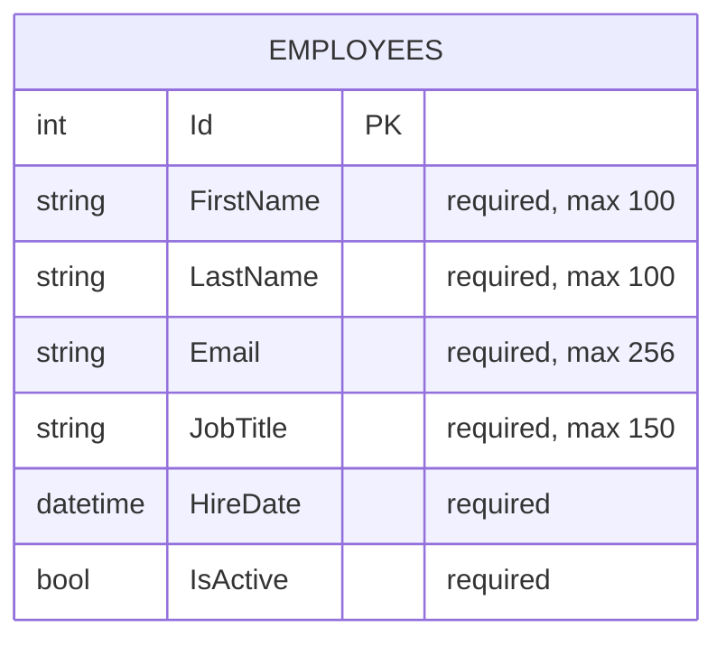

# DotNet Razor Pages Entity Relationship Diagram (ERD)

## Document Control
- Document ID: DRP-ERD-001
- Version: 1.0
- Date: 2026-03-18
- Status: Draft
- Source of Truth: `DotNetRazorPages.Data/Context/ApplicationDbContext.cs`

## 1. Purpose
This document describes the current relational data model for the solution.

## 2. ERD (Current Persisted Schema)

## 3. Constraints and Indexes
- Primary Key:
  - `PK_Employees` on `Id`
- Unique Index:
  - `UX_Employees_FirstName_LastName` on `(FirstName, LastName)`
- Required Columns:
  - `FirstName`, `LastName`, `Email`, `JobTitle`, `HireDate`, `IsActive`
- Column Lengths:
  - `FirstName` max 100
  - `LastName` max 100
  - `Email` max 256
  - `JobTitle` max 150

## 4. Relationship Notes
- Current persisted model contains a single entity/table (`Employees`).
- No foreign-key relationships are currently defined in the SQL schema.
- Active Directory data used by admin lookup flows is external integration data and is not persisted as relational entities in this schema.

## 5. Future Expansion Template
Use this section when additional entities are introduced.

Example placeholders:
- `Departments` (1) -> `Employees` (many)
- `AuditEvents` (many) -> `Employees` (optional many-to-one)
- `Roles` and `Users` for production identity persistence (if introduced)

## 6. Related Documents
- `docs/SYSTEMS_architecture.md`
- `docs/data-flow-chart.md`
- `docs/requirements.md`
- `docs/business-requirements.md`
