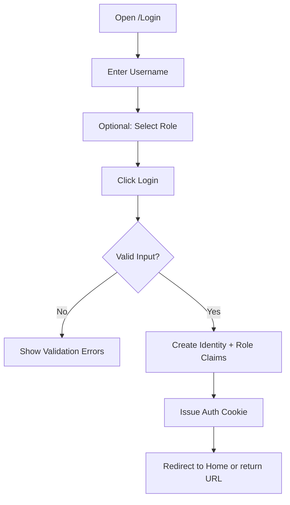
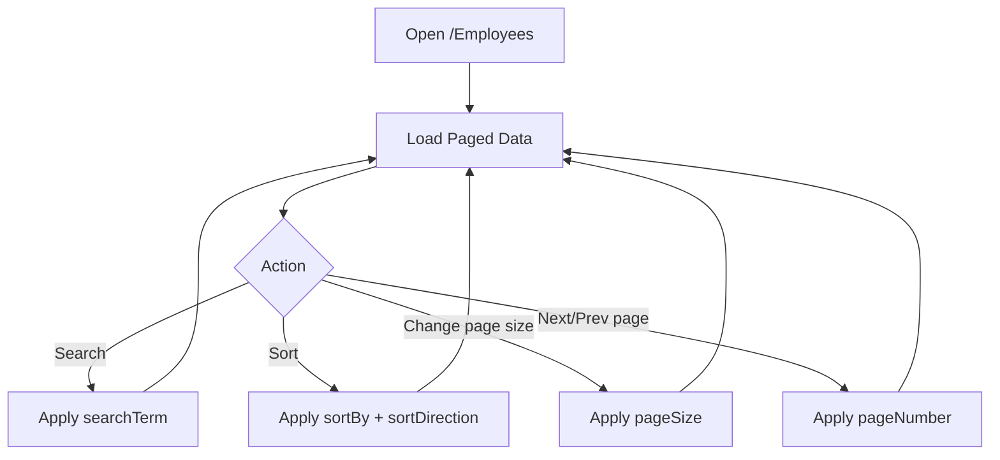
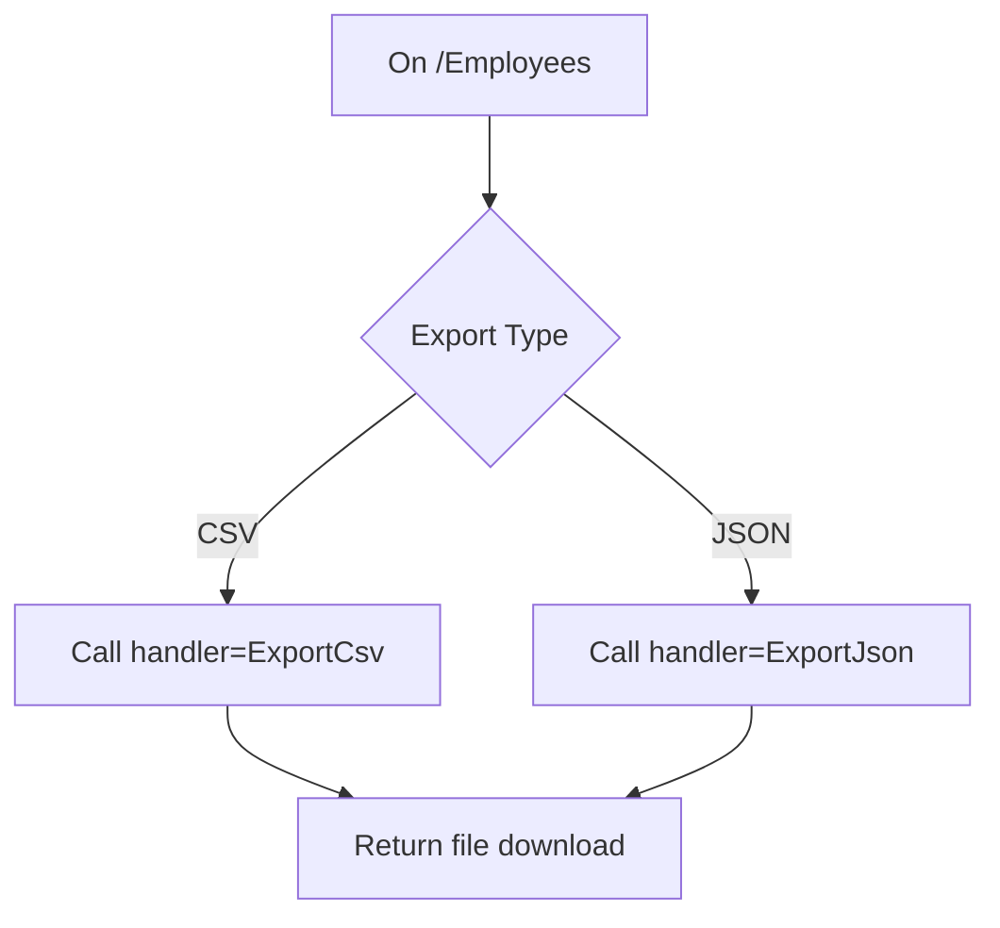
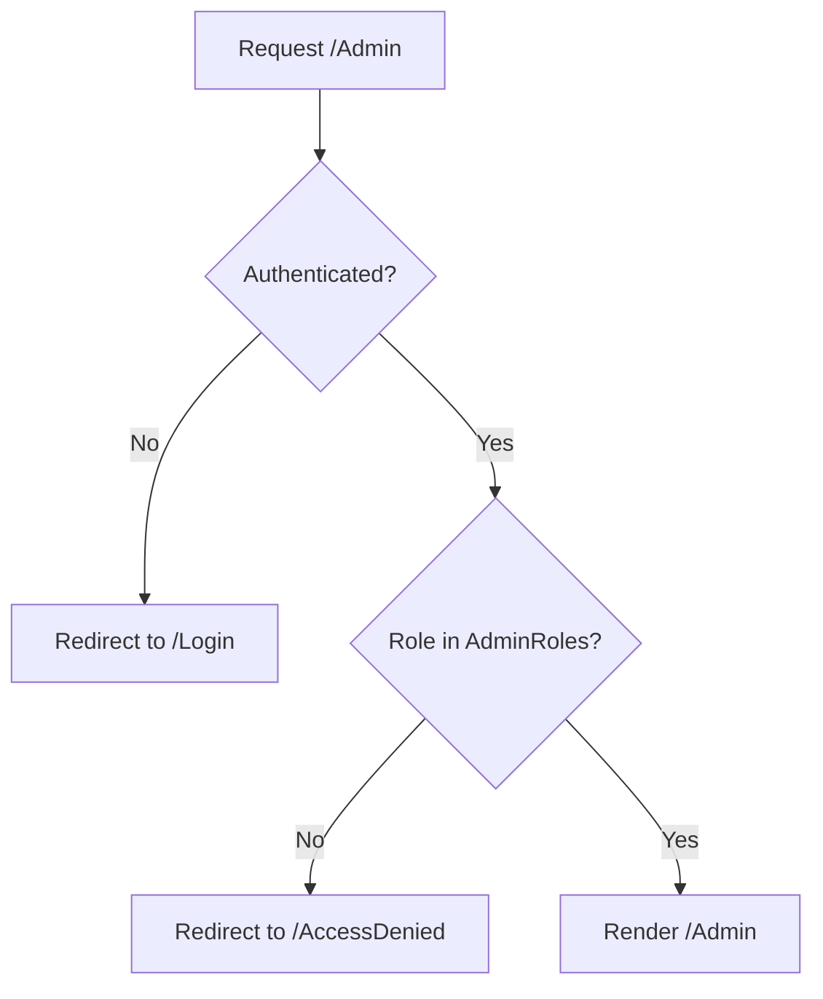
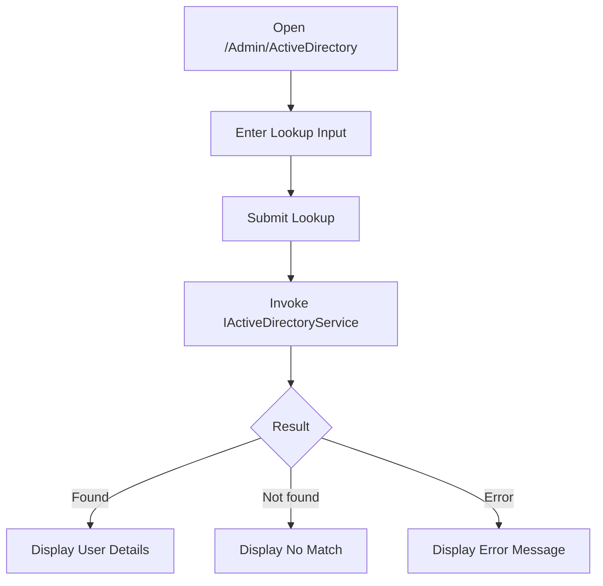

# DotNet Razor Pages User Flows

## Document Control
- Document ID: DRP-UF-001
- Version: 1.0
- Date: 2026-03-18
- Status: Draft
- Audience: Product, Design, Engineering, QA, Security

## 1. Purpose
This document describes the primary user journeys through the DotNet Razor Pages solution. It is intended to align stakeholders on expected behavior, decision points, and role-based branching.

## 2. Personas
- Standard User: can browse and manage employee records available to authenticated users.
- Admin User: has all Standard User capabilities plus access to admin and Active Directory pages.
- Unauthenticated Visitor: can reach public pages (for example login), but is redirected from protected routes.

## 3. Global Navigation Flow
```mermaid
flowchart LR
    Start[Open Application] --> Auth{Authenticated?}
    Auth -- No --> Login[/Login Page]
    Auth -- Yes --> Home[/Home]

    Home --> Employees[/Employees]
    Home --> AdminCheck{Has Admin Role?}
    AdminCheck -- Yes --> Admin[/Admin]
    AdminCheck -- No --> NoAdmin[Admin Links Hidden]
```

## 4. Flow A: Login and Session Start

### Narrative
1. User opens login page.
2. User enters username and optionally chooses role (in current test-oriented auth model).
3. User submits login form.
4. System issues auth cookie and redirects.

### Diagram


## 5. Flow B: Browse, Search, Sort, and Page Employees

### Narrative
1. User opens Employees page.
2. System loads paginated employee list.
3. User can search by first name, last name, or job title.
4. User can sort by supported columns and navigate pages.

### Diagram


## 6. Flow C: Create Employee

### Narrative
1. User opens create mode (`/EmployeeDetail` without id).
2. User enters employee details.
3. System validates inputs.
4. On success, system creates record and redirects to detail view.

### Diagram
```mermaid
flowchart TD
    A[Open /EmployeeDetail] --> B[Render Empty Form]
    B --> C[Enter Employee Data]
    C --> D[Click Create]
    D --> E{Model Valid?}
    E -- No --> F[Display Validation Errors]
    E -- Yes --> G[Create Employee]
    G --> H[Redirect to /EmployeeDetail/{id}]
```

## 7. Flow D: Update/Delete Employee

### Narrative
1. User opens existing employee detail page.
2. User edits fields and saves, or chooses delete.
3. System persists update or removes record.

### Diagram
```mermaid
flowchart TD
    A[Open /EmployeeDetail/{id}] --> B{Action}
    B -- Update --> C[Edit Fields]
    C --> D[Click Save]
    D --> E{Model Valid?}
    E -- No --> F[Show Validation Errors]
    E -- Yes --> G[Update Employee]
    G --> H[Redirect with Success Message]

    B -- Delete --> I[Click Delete]
    I --> J[Confirm Prompt]
    J --> K{Confirmed?}
    K -- No --> A
    K -- Yes --> L[Delete Employee]
    L --> M[Redirect to /Employees]
```

## 8. Flow E: Export Data

### 8.1 List Export (CSV/JSON)


### 8.2 Employee Detail Export (PDF)
```mermaid
flowchart TD
    A[On /EmployeeDetail/{id}] --> B[Click Export to PDF]
    B --> C[Call handler=ExportPdf&id={id}]
    C --> D[Load Employee]
    D --> E{Employee Exists?}
    E -- No --> F[Return NotFound]
    E -- Yes --> G[Generate PDF via IEmployeePdfService]
    G --> H[Return application/pdf file]
```

## 9. Flow F: Admin Authorization

### Narrative
1. User attempts to access `/Admin`.
2. If unauthenticated, system redirects to login.
3. If authenticated but role is not allowed, system redirects to access denied.
4. If user has allowed role, admin page renders.

### Diagram


## 10. Flow G: Active Directory Lookup (Admin)

### Narrative
1. Admin opens Active Directory page.
2. Admin submits lookup criteria.
3. Service queries AD and returns user result or not found/error.

### Diagram


## 11. Error and Edge Flows
- Unknown route -> 404 page behavior
- Missing or invalid employee id on detail/export -> NotFound
- Validation errors on create/update -> stay on page with error messages
- Unauthorized protected route access -> redirect to login or access denied

## 12. QA Acceptance Checklist (Flow-Oriented)
- Login flow succeeds and issues authenticated session
- Employee list supports search/sort/pagination loop
- Create/update/delete flows persist expected results
- CSV/JSON/PDF exports return correct file types and downloads
- Admin route role checks enforce redirects and allow valid roles
- Active Directory lookup presents success/no-result/error states correctly

## 13. Related Documents
- One-page summary: `docs/one-page-summary.md`
- Requirements: `docs/requirements.md`
- Architecture: `docs/architecture.md`
- Systems architecture: `docs/SYSTEMS_architecture.md`
- Wireframes: `docs/wireframes.md`
